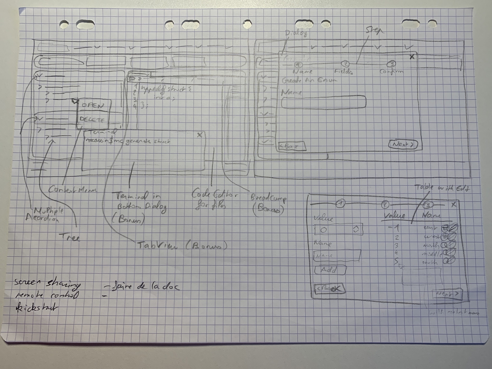
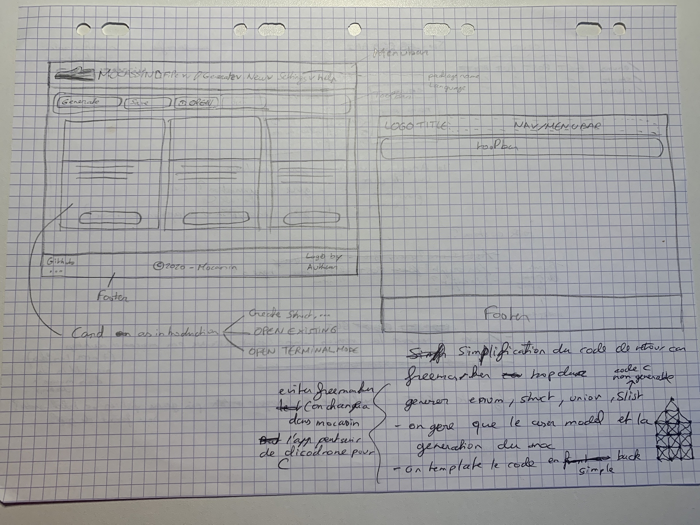

# A bit about the design

On the drawings above you can see the first sketches for the ui of the web version.

When I first designed the interface, I didn't realized how many things I needed to take into account.
In the future the web version should tend to the sketches. 

For now the ui is much more simple for a simple reason. This version of mocassin is called
a Most Valuable Product which means it is a more simple version than the one expected to make sure the user can
use the application for simple things like generating his or her data.

## What to read next

- [Welcome page](doc/welcome.md)
- [How to install mocassin on your own](doc/install.md)
- [How to use mocassin](doc/tuto.md)

