# A tutorial on how to use Mocassin Web app

Here is the home page:

The sections below will be described in detail:
- **The navbar** on top to create new data, change preferences and access to the project code
- **The toolbar** to quickly generate a new project and generate the final preview
- **The tree of data** that display all of your data in a simple view where you can preview, edit or delete each of them

## Top navbar

### New menu

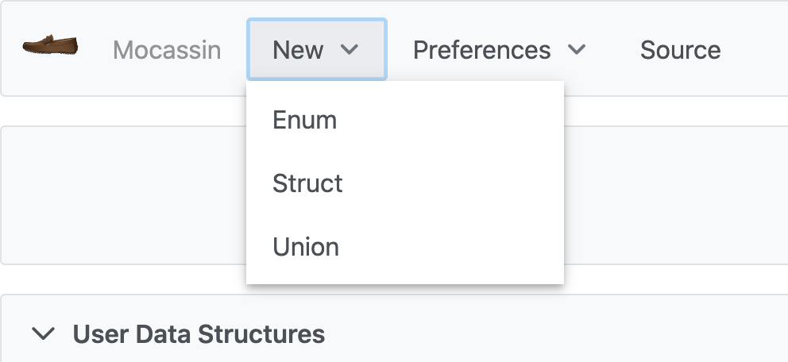

1. Choose the data you want to create
2. A wizard below the toolbar will appear to start adding your data information

### Preferences

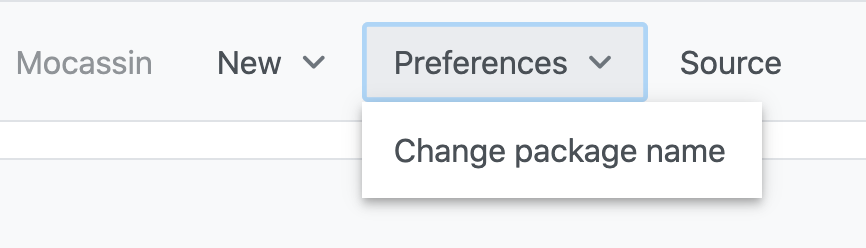

Click on this menu to make appear a dialog box to change the package name on the right side of the app

**NOTE**: you can also click on the package name at the top right to open the same dialog.

The package name is used to identify the C header generated using `#ifndef`

### Change the package name

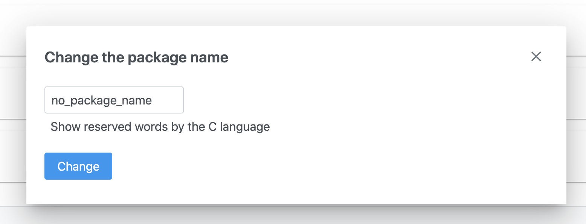

You can start edit the name which should be **alphanumeric**. 
⚠️ The input will not let you insert spaces or special characters. ⚠️ 

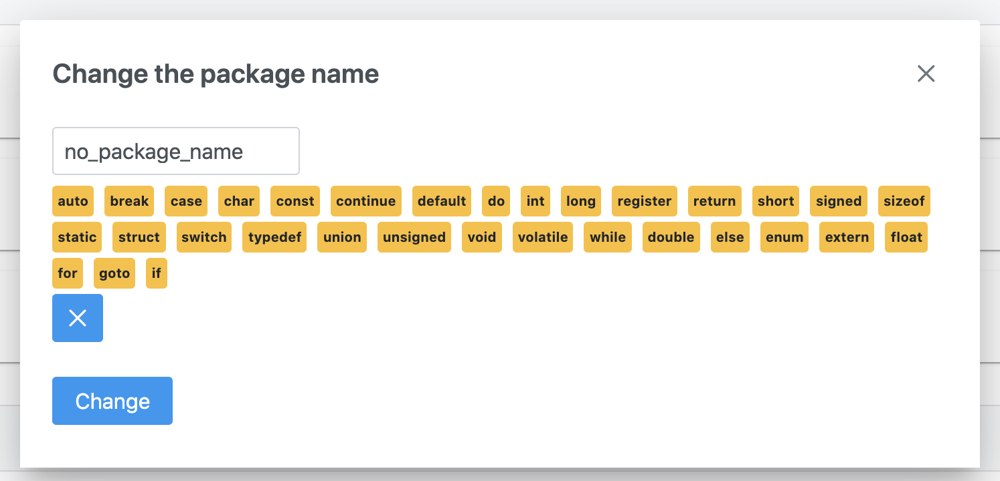

if you click on `Show reserved keywords`, a list of reserved words by the `c` language will be displayed. 

⚠️ These are the words forbidden for the package name. do not use it ! Otherwise here is what's happen ! ⚠️ 

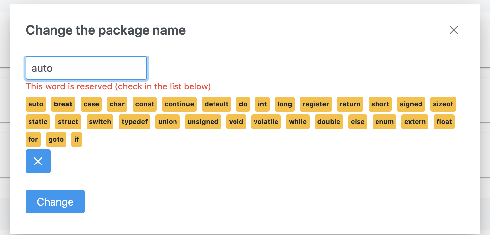

A nice error message has been prompted because you didn't respect the rule I just told you before.

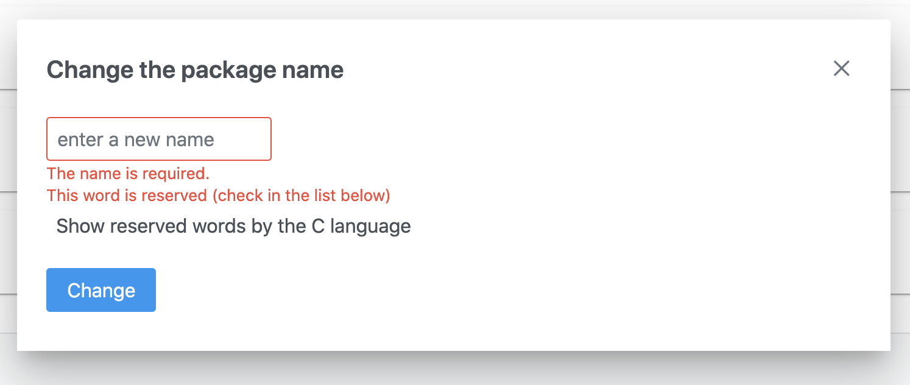

And this is what happen if you don't give a name to your file !

## User Data Structure tree

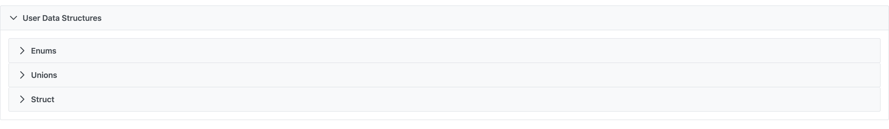

If the data tree is getting to big, you can fold each parts.

### Code preview

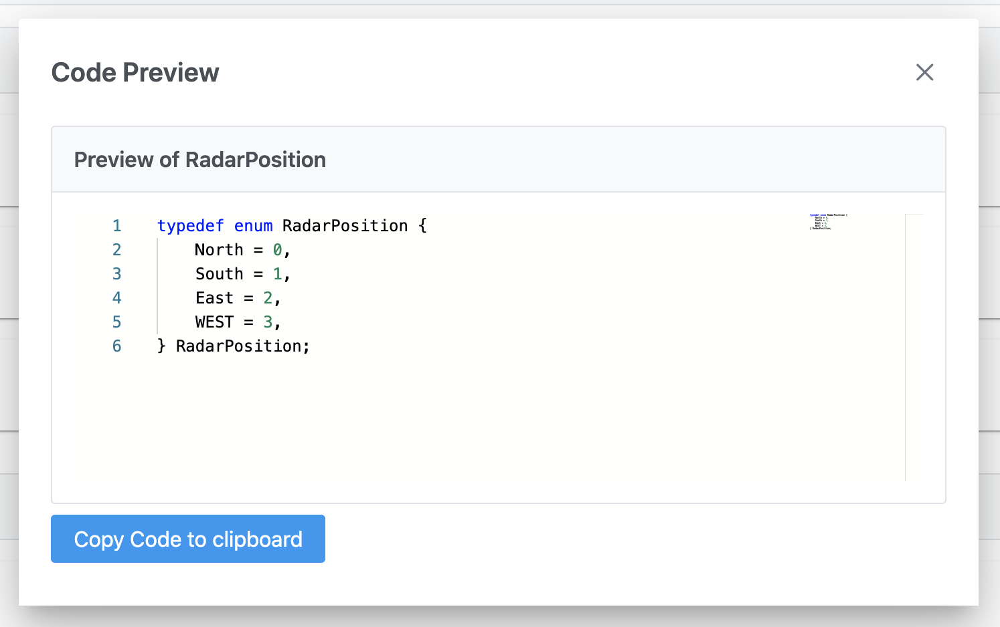

By clicking on the preview button in blue for the data you choosed, you can quickly preview the `c` code of your data.

You can also copy the code to your clipboard using the button `Copy to Clipboard` in blue

**NOTE**: you can right click on the code editor, a context menu will appear for more options. Note that the code is **read only**. Do not
try to edit this code because it simply doesn't work !

## New enum workflow

Let's create a new enumeration to see the creation workflow.

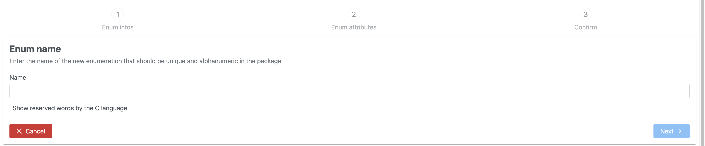

Once you clicked on `New enum` in the menu bar, this wizard opens. This is the first step to create your `enum`
Enter the name you want but be careful ! Remember the reserved words for the `package name` ? The same rule is applied for this input also. And also
for the step 2 and any other inputs where you are required to enter the name. This is mainly to avoid code injection and compilation errors by `gcc`.

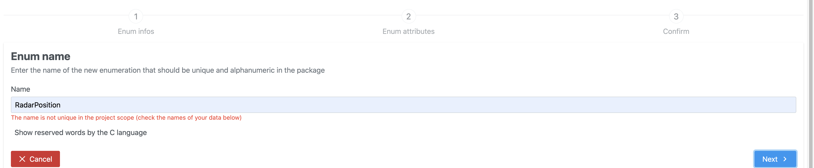

As sneaky as you seems to be, you tried to enter the same name than another data in the global project. This is not allowed ! Please try another name, I am sure
you have plenty of words in mind.

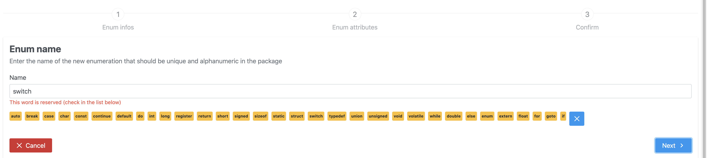

Of course, you can't input a reserved words by the `c` language. A little reminder has been added for you just below the input.

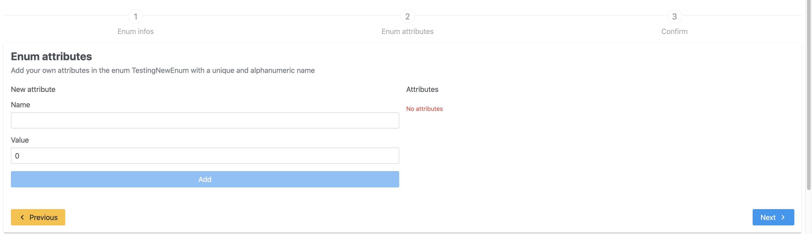

Alright, the first step is done, now we can move on the second step:
- On the right side, you will find a new form to add your own attributes to your `enum`.
you can give any values by selecting it in the second input otherwise the value will be automatically increased for you.

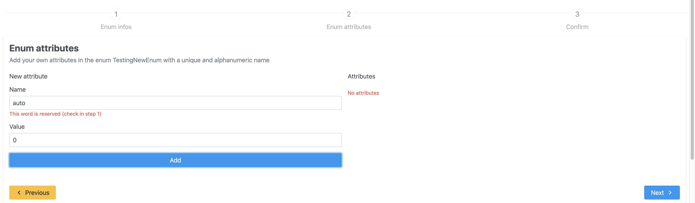

- On the left side, you will find the list of the attributes you entered. You can delete an attribute by clicking on the red cross.

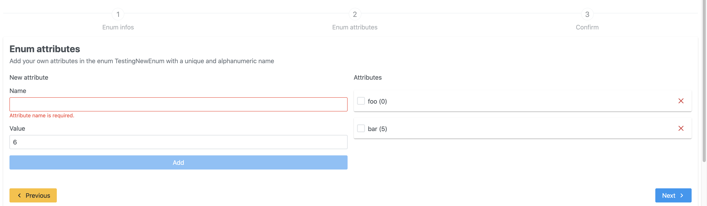

I forgot to tell you that the same rules are applied for the attribute name than the `enum` name. And be aware that a new attribute name need to be unique in the `enum`.

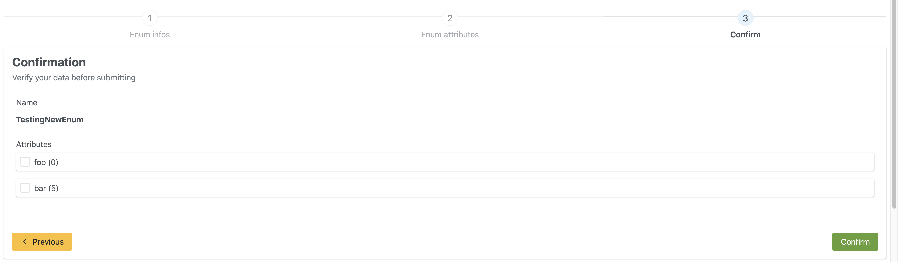

Once the first step and second one are done, here is a recap of what you did. If everything looks ok for you, you can click on the green
confirm button. The wizard closes. The new data appears into the tree.

**NOTE to any sneaky fox 🦊**: don't try to escape any step using the url, the interface will automatically redirect you to the first step !

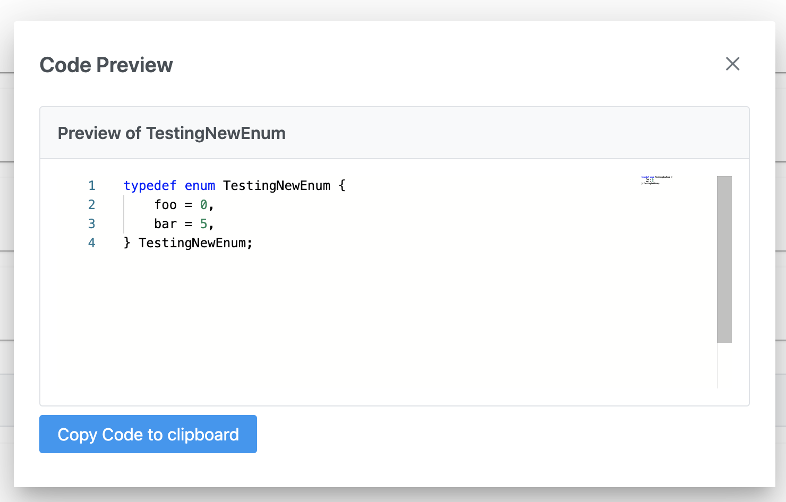

Here is what our new `enum` looks like !

## New struct or union workflow

Let's see how to create a `struct` now. Follow the same steps for an `union` by clicking on `New union` in the menu.

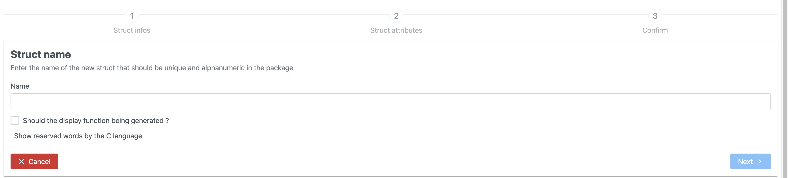

This is the same step as creating an `enum`. You can also check the box below the name to indicate if you want to generate the display function. So far, this feature hasn't been designed yet in the `c` code template, so it
will just add a comment on top of the `struct` definition.

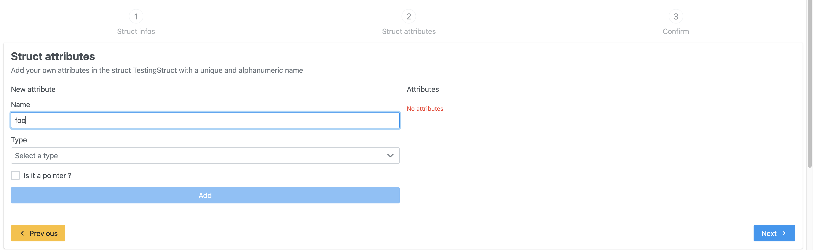

You can now add the fields of your `struct` in this step. 

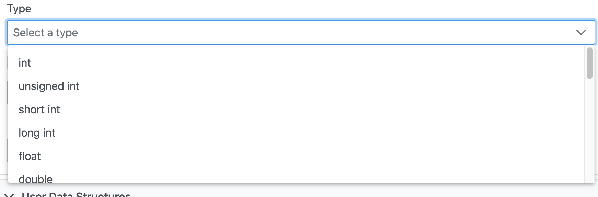

Choose from the list the name input. 

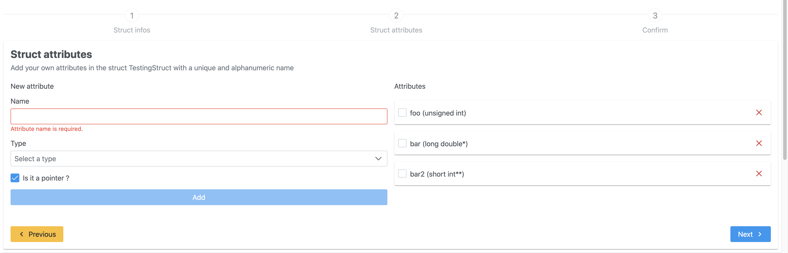

If you want the type to be a pointer, you can check the little box just after. 
You will notice a new `*` in addition to the attribute type.

example: you choose the type `unsigned int*` which is already a pointer. If you check the `isPointer` box,
the new type will be `unsigned int**`.

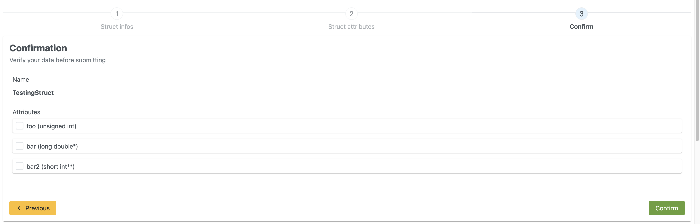

Once again, there is a confirmation step to check that everything looks great !

## Edit mode

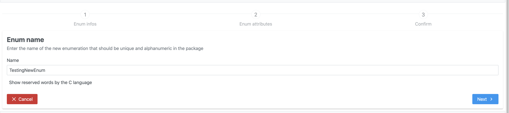

In case you need to edit a data, click on the yellow `edit` button in the tree, the same wizard as during the creation opens. 
Follow the same steps to edit your data by clicking on the `next` button if you don't need to make any changes on first step for example.

NOTE: to edit an attribute, just delete it, and add a new one.

## Toolbar

### New project

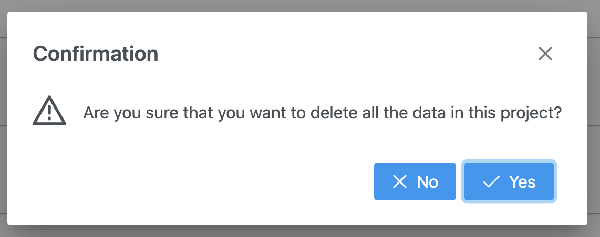

If you desire to erase all what you did before, click on `New Project` in the toolbar. In case you missed click on this button, we added a confirmation dialog to confirm your choice.

### Generate

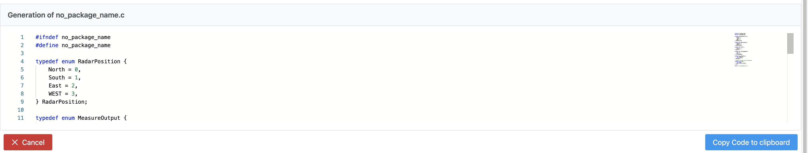

When you added enough data, just click on the green button `Generate` in the toolbar. This will open a new preview code editor at the same place as the wizards.

This will be the final piece of code you was looking for by openning the app. Just copy it to your clipboard using the bluw button `Copy to Clipboard` and you are ready to add all of this data structures
to your favorite `c` program.

## What to read next

- [Welcome page](welcome.md)
- [How to install mocassin on your own](install.md)
- [The design story](design.md)
