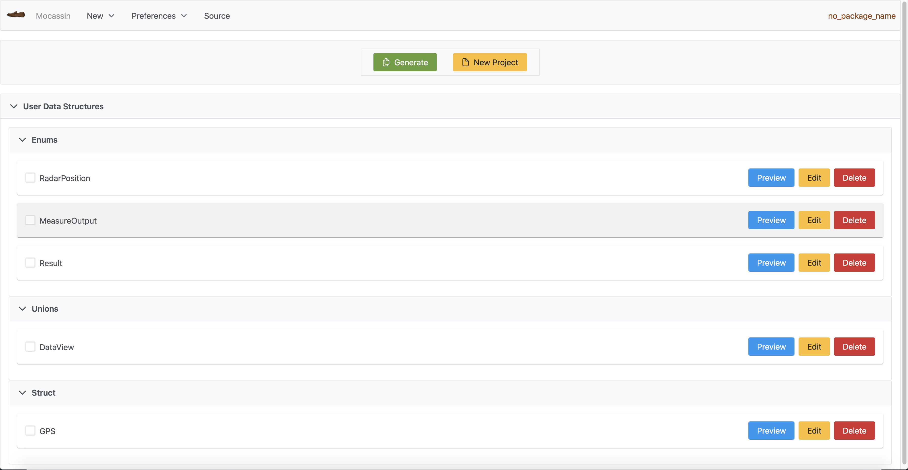

# Welcome to Mocassin Web

**Mocassin** web is the web app version of the [Mocassin](https://github.com/david6983/mocassin) software written in [Kotlin](http://kotlinlang.org/)
and the ui framework [TornadoFx](https://tornadofx.io/). 

Mocassin is a graphical interface to generate data structures such as [Enum](https://www.geeksforgeeks.org/enumeration-enum-c/), [Union](https://www.geeksforgeeks.org/union-c/) and [Struct](https://www.geeksforgeeks.org/structures-c/) in C programming. 

Before you read the tutorial, We would like to introduce the term `data` as `data structure` that refers to the data that
can be generated by the app. `app` refers always to the `Mocassin Web App` version.

## Where the idea come from ?

The idea behind the original software comes from my first classes of C when I learned how to create linked lists. 
I wanted to generalize the variables inside linked lists without using `void*`. 
My teacher told me that we can use union in C and add as many types as we want in a linked list. 
The main issue I found with `void*` is, in my opinion, not type-safe to use.

But, wait, why are you talking about linked list ? Well, this web version is only a proof-of-concept so far to evaluate how many changes need to be done
to link the two versions in the future. So far, the web version is a first version (most valuable product). The main purpose of this version is 
to generate a user model (single file) with all the data you added. We will see later on how to create this file.

Concerning the output of the generation, you will probably notice the app do not make you download a `.c` file at the end. In fact, you will get a preview
in a code editor of the code that you can copy to your clipboard. Why only a preview then ? In fact, concerning the security a website should not make you download
code that you probably don't know. Maybe it could be malware inside the `c` code. So I decided to let you do this part on your own.

## What to read next ?

- [How to install mocassin on your own](install.md)
- [How to use mocassin](tuto.md)
- [The design story](design.md)

